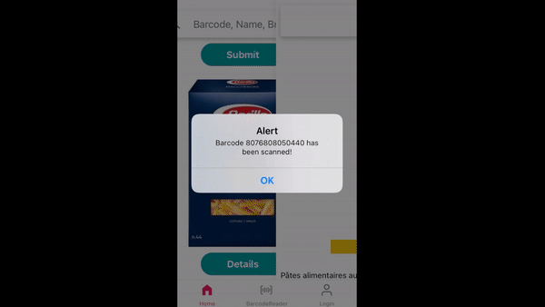

# Revieu Frontend / Backend


Product Review App with Barcode Scan and Camera functions  


## Table of Contents

  - [Table of Contents](#table-of-contents)
  - [About the app](#about-the-app)
    - [Screenshots](#screenshots)
    - [Features](#features)
  - [Running locally](#running-locally)
    - [Requirements](#requirements)
    - [Steps](#steps)
  - [Technologies](#technologies)
  - [Collaboration](#collaboration)
  - [Upcoming features](#upcoming-features)
  - [Credits](#credits)

## About the app

Product Review App with Barcode Scan and Camera functions.
Create this app for Japanese who is new or live in Europe.
Scan the product and see the reviews. 
Add Product infomation(Photos automatically  Open food facts API (https://de.openfoodfacts.org/data) and store it to our MongoDB data base


### Screenshots




### Features

1. Secure login / Registration 
2. Refersh Token
3. Searching / Adding products by scan barcode
4. Store scanned product into Database automatically
5. Review products
6. Filter product by product name, barcode, any keywords


## Running locally

### Requirements

- Node & NPM
- [Expo CLI](https://docs.expo.io/workflow/expo-cli/)
- Expo Go mobile app or iOS Simulator and/or Android emulator

### Steps

##Frontend

```
$ git clone git@github.com:carveler/Revieu.git
$ cd Revieu/mobile-client/  
$ npm install 
$ npm start
```

##Backend

```
$ git clone git@github.com:carveler/Revieu.git
$ cd Revieu/server/
$ npm install 
$ touch .env
Add a MONGO_URI && JWT_SECRET && JWT_EXPIRY to the .env file
$ npm start
```
## Technologies

###Frontend

1. React Native
2. React Navigation
3. Redux 
4. Expo
5. Axios
6. React Native Paper
7. React Hook Form
8. a number of 3rd-party libraries

###Backend

1. Node.js
2. MongoDB
3. Express
4. Cloudinary
5. Open food facts API (https://de.openfoodfacts.org/data)
6. a number of 3rd-party libraries


## Upcoming features

1. Desktop Client App with Next.js


## TEAM

- [Elias Guderian](https://github.com/GuderianE), Full Stack
- [Mami Kurokawa](https://github.com/carveler), Full Stack


